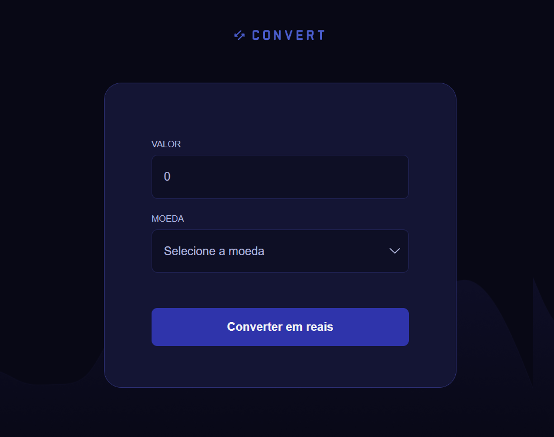

# 💱 Conversor de Moedas

Este é um projeto simples de conversor de moedas feito com HTML, CSS e JavaScript. O aplicativo permite ao usuário inserir um valor e convertê-lo para Reais (BRL) com base em diferentes moedas estrangeiras com taxas de câmbio fixas.

## Preview

## Funcionalidades

- Conversão de valores para Real (BRL) a partir de:
  - Dólar Americano (USD)
  - Euro (EUR)
  - Libra Esterlina (GBP)
  - Dinar do Kuwait (KWD)
  - Yuan Chinês (CNY)
  - Iene Japonês (JPY)
- Formatação do resultado em Real Brasileiro
- Validação do input (somente números)
- Interface simples e responsiva

## Tecnologias Utilizadas

- HTML5
- CSS3
- JavaScript (vanilla)
